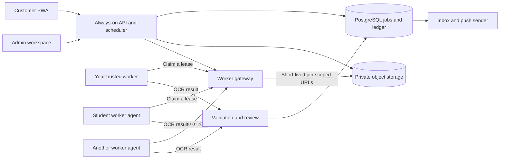

# Distributed student workers: proposal, not implemented

## Recommendation

Start with this Ubuntu computer as one trusted worker. Next, add a second trusted computer and measure throughput, availability and OCR accuracy. Only then consider a paid student-worker pilot. The current shared Celery worker architecture is suitable for machines you control, not arbitrary student computers.

Your system can coordinate development and an early pilot, but a production coordinator should run on an always-on server. If the coordinator, your network, or your laptop sleeps, new work stops. Hosting the control plane separately lets you also use your computer as a worker without making it the single point of availability.

## How the parts fit together

A coordinator decides what work is eligible and who can perform it. Worker agents ask for jobs over outbound HTTPS, so students do not open router ports. Each agent receives a limited-duration lease, a small task, and URLs allowing only the assigned input/output. It returns structured results, engine version, timings and a result hash. The coordinator verifies the result before accepting it or crediting earnings.

The existing app already has durable jobs, retries, execution tokens and locks. Its trusted Celery workers share database, broker and object-storage credentials. **Do not distribute `.env.worker` to students.** A student marketplace needs the worker gateway, isolated identities, per-job authorization, expiring leases and result validation first. These are proposed additions, not features delivered in this change.

## Work units and machine suitability

Run page OCR independently where possible, then aggregate all pages for a respondent centrally. Page-level work must preserve order, ownership and questionnaire-page identity. Human review and the final release stay central. Embedded-text PDFs can often bypass image OCR; schedule them accordingly.

Do not pay based solely on advertised CPU/RAM/GPU specifications. Run a fixed benchmark and score **verified pages per second at acceptable accuracy**, peak memory, reliability and measured energy/bandwidth needs. A student can spoof hardware reports. Different document types and engine configurations need separate benchmark groups.

Initial engineering targets to validate, not proven requirements:

| Worker tier | Starting target | First policy |
| --- | --- | --- |
| CPU pilot | Modern x86-64 CPU, 8–16 GB RAM, several GB free model/cache space | One concurrent task; benchmark on typical scans |
| Larger CPU | More available memory and cores | Increase concurrency only after measuring total RAM and throughput |
| GPU | Compatible supported GPU/runtime and enough VRAM for chosen models | Separate queue/container and repeatable benchmark; do not promise a fixed VRAM minimum without testing |

This computer has 16 GB RAM and already runs PaddleOCR. Available memory at inspection was roughly 2.8 GB, so one worker process is the initial setting. GPU acceleration is not necessary to start this pilot. CPU percentage limits, pause/resume, power/battery controls and clear bandwidth usage would matter to students.

## Reliability, data protection and payment

- **Leases and retries:** heartbeat each assignment; expired leases can be reassigned. A lease generation/execution token rejects late results. Only one accepted output and one payable ledger entry per task.
- **Quality checks:** validate schemas and page counts, include known-answer benchmark jobs, and selectively duplicate tasks across workers. OCR confidence alone is not evidence of honesty. Human review remains necessary.
- **Privacy:** a machine that can OCR a document can read it. Containers, encryption in transit and temporary URLs cannot prevent the machine owner from copying plaintext. Use synthetic or explicitly approved non-sensitive scans for an initial student pilot; retain sensitive data on trusted infrastructure.
- **Device isolation:** sign worker identities, rotate/revoke tokens, limit download scope and TTL, pin container/model versions, and avoid running arbitrary user-provided code. Containerization improves reproducibility; it is not a complete trust boundary against the host owner.
- **Payment accounting:** record accepted work in an append-only ledger with unique job/lease references. Separate pending, accepted, rejected, payable and paid states; enforce reconciliation and manual dispute handling. Never credit claimed hours, self-reported speed or raw job submissions without validation.
- **Economics:** measure revenue per accepted page minus worker payout, storage/egress, repeated OCR, admin review, payment fees and support. Avoid promising rates or earnings until a controlled trial establishes these costs.

A Runpod-like marketplace is a second product: provider onboarding, hardware qualification, scheduling, resource isolation, billing, fraud detection, support and privacy controls. For your app, a small task-processing network is more manageable than renting complete student computers to arbitrary customers.

## Proposed rollout

1. **Now:** one trusted Ubuntu worker, benchmark representative forms, record latency/memory and prove recovery. Keep notifications independent from OCR.
2. **Trusted scaling:** add a second controlled worker on the same queue; verify duplicate-job exclusion and migration compatibility; monitor queue costs.
3. **Gateway pilot:** replace broad student-side credentials with per-worker identities and scoped job leases. Test forced disconnects, malicious outputs, replays and duplicate results using synthetic documents.
4. **Paid pilot:** a small invited group, capped payouts, explicit non-sensitive jobs, quality review and an auditable ledger.
5. **Marketplace:** only if demand, unit economics, privacy and operator capacity justify it.

Nothing from stages 2–5 has been implemented here. Suggested next decision: benchmark your current worker before choosing a student payout model.

Primary references: [Celery task idempotency and acknowledgements](https://docs.celeryq.dev/en/stable/userguide/tasks.html), [Celery prefetch and resource optimisation](https://docs.celeryq.dev/en/stable/userguide/optimizing.html), [PaddleOCR installation](https://paddlepaddle.github.io/PaddleOCR/main/en/quick_start.html). The architecture and rollout above are engineering recommendations for this repository, not guarantees from those sources.
